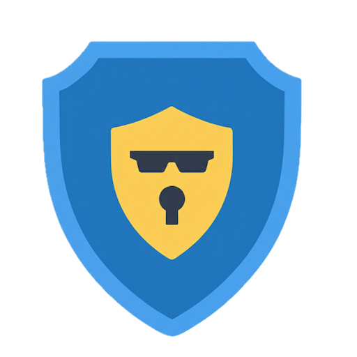

# Clipboard Shield

🔐 Safeguard your privacy by preventing malicious applications from accessing sensitive data copied to the clipboard.

Clipboard Shield is a project designed to monitor and protect the system clipboard from unauthorized access.

## ⭐️ Key Features
- ✔️ Protection of clipboard content against unauthorized access.
- ✔️ Implementation of hooks for event detection.
- ✔️ Inter-process communication (IPC) for security management.
- ✔️ Use of custom threads to optimize performance.
- ✔️ Logging capabilities for security auditing.
- ✔️ Windows service integration for continuous protection.

## 🔨 Building from Source

For users who prefer to build from source, follow the detailed instructions available at the documentation: [Build from Source](doc/BuildFromSource.md).

## ⚙️ Installation from Binary

### Supported Platform

* Requeriments:
  * Windows 10 (64-bit) or Windows 11
  * Administrator privileged (required for installation)
 
### Installation Steps   

1. Download the latest binary release from [GitHub Releases](https://github.com/CoinFabrik/ClipboardShield/releases) 
2. Run `ClipboardShield.exe` to install the application.
3. Launch `trayicon.exe` to monitor the service status. The application should be running in the system tray.

## Configuration
[Configuration and use cases](doc/Configuration.md).

## Log file example
```
Loading configuration from C:\ProgramData\CoinFabrik Clipboard Shield\config.txt
Configuration description:
Default policy: allow
Source rules:
first party c:\windows\system32\notepad.exe: default deny
    second party c:\windows\system32\notepad.exe -> allow
first party C:\Program Files\KeePass\KeePass.exe: default deny
    second party C:\Program Files\Mozilla Firefox\firefox.exe -> allow
    second party C:\Program Files\Google\Chrome\Application\chrome.exe -> allow
first party C:\Program Files\Mozilla Firefox\firefox.exe: default allow
    second party C:\Program Files\Google\Chrome\Application\chrome.exe -> deny
Destination rules:
...
PID 3356 (C:/Windows/explorer.exe) from session 1 wants to paste. Result: paste is allowed. Explanation: destination = C:/Windows/explorer.exe, using default policy
PID 3356 (C:/Windows/explorer.exe) from session 1 wants to paste. Result: paste is allowed. Explanation: destination = C:/Windows/explorer.exe, using default policy
PID 16548 (C:/Users/feder/AppData/Local/slack/app-4.43.43/slack.exe) from session 1 wants to paste. Result: paste is allowed. Explanation: destination = C:/Users/feder/AppData/Local/slack/app-4.43.43/slack.exe, using default policy
Hooking PID 15204 path: C:/Windows/System32/WerFault.exe
...
```
## Known Issues
* [Clipboard Shield service keep after application uninstall](https://github.com/CoinFabrik/ClipboardShield/issues/1)

## 💡 Contribution
If you would like to contribute:
- Fork the repository.
- Create a new **branch** (`feature-new-functionality`).
- Submit a **pull request** with a clear description of the changes.

## ☣️ Standard Security Classification
-  [Clipboard Data: MITRE ATT&CK® Classification Technique T1115](https://attack.mitre.org/techniques/T1115/)

## 🌐 About CoinFabrik 
We - [CoinFabrik](https://www.coinfabrik.com/) - are a research and development company specialized in Web3, with a strong background in cybersecurity. Founded in 2014, we have worked on over 180 blockchain-related projects, EVM based and also for Solana, Algorand, Stellar and Polkadot. Beyond development, we offer security audits through a dedicated in-house team of senior cybersecurity professionals, currently working on code in Substrate, Solidity, Clarity, Rust, TEAL and Stellar Soroban.

Our team has an academic background in computer science and mathematics, with work experience focused on cybersecurity and software development, including academic publications, patents turned into products, and conference presentations. Furthermore, we have an ongoing collaboration on knowledge transfer and open-source projects with the University of Buenos Aires.

## 📜 License
This project is licensed under the MIT License - see the LICENSE file for details.

